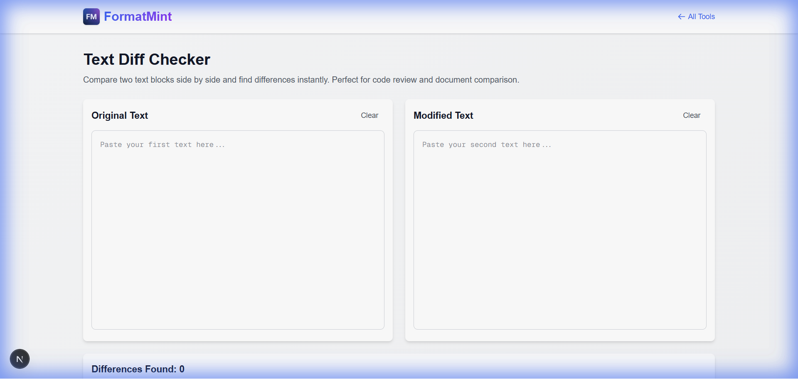

# Compare Text and Code Differences Online

Have you ever stared at two versions of a file, trying to figure out *what on earth changed*?

Maybe it's a config file that broke production. Maybe it's a contract with a "minor tweak" from legal. Or maybe it's just two versions of your own code.

Human eyes are terrible at spotting missing commas or slightly altered variable names. Computers, however, are perfect at it.

## Why You Need a Diff Checker

A "Diff Checker" highlights exactly what has been added, removed, or modified between two pieces of text.

*   **For Developers:** Debug code by comparing the working version with the broken one.
*   **For Writers:** See what your editor changed in your latest draft.
*   **For Everyone:** Verify that a copied list matches the original.

## Introducing the FormatMint Diff Checker

We built a clean, side-by-side comparison tool that highlights changes in intuitive colors (Green for additions, Red for deletions).

### Key Features

1.  **Side-by-Side View:** See both texts next to each other with line numbers.
2.  **Syntax Highlighting:** Paste JSON, CSS, or JS, and we'll format it for readability.
3.  **Instant Feedback:** No need to click "Upload" or "Process". It works as you type.

## How to Use It

1.  **Paste Original:** Put your "Version A" text in the left box.
2.  **Paste Modified:** Put your "Version B" text in the right box.
3.  **Analyze:** The tool instantly highlights the differences.

> **Pro Tip:** Use this tool to check your `package.json` or `.env` files before deploying to ensure you haven't missed a critical config change.

## Stop Guessing

Don't rely on your memory or your eyesight. Let the tool do the work.

[**Compare Text Now →**](/tools/diff-checker)
