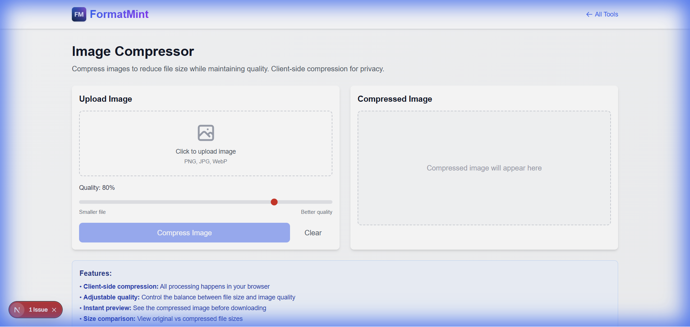

# How to Compress Images for Web (Without Losing Quality)

We've all heard the stat: **53% of mobile users abandon sites that take longer than 3 seconds to load.**

And the #1 culprit for slow sites? Unoptimized images.

You upload a beautiful 5MB photo from Unsplash, and suddenly your Lighthouse score drops to 40. But you don't want to serve a pixelated, blurry mess just to save a few kilobytes.

## The Sweet Spot: Quality vs. Size

Image compression is all about finding the balance.
*   **Too much compression:** Artifacts, banding, and blurriness.
*   **Too little compression:** Slow load times and angry users.

The trick is to remove the data that the human eye *can't see*.

## Enter the FormatMint Image Compressor

Our tool uses smart compression algorithms to strip out metadata and optimize color profiles without touching the visual fidelity of the image.

### Features

*   **Smart Lossy Compression:** Reduces file size by 70-90% with zero visible difference.
*   **Privacy First:** All compression happens **in your browser**. Your photos are never uploaded to our servers.
*   **Batch Processing:** Drag and drop multiple files at once.

## How to Use It

1.  **Upload:** Drag your PNG, JPG, or WebP files into the drop zone.
2.  **Adjust:** Use the quality slider to find your perfect balance (we recommend 80% for most web uses).
3.  **Compare:** Use the "Before/After" slider to verify the quality.
4.  **Download:** Save your optimized images instantly.

## Why It Matters for SEO

Google loves fast sites. By serving optimized images, you're not just making users happy; you're signaling to search engines that your site is high-quality.

Don't let heavy images weigh you down.

[**Compress Your Images Now →**](/tools/image-compressor)
