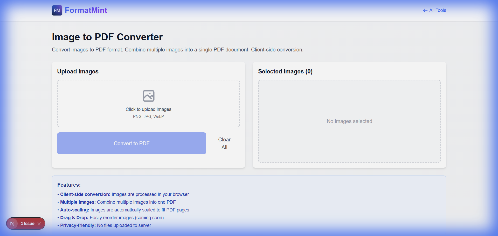

You have 5 screenshots of a bug report. Or 10 photos of receipts for your expense report.
You can't just email 10 separate JPG attachments. That's messy.

You need a single PDF.

Our [Image to PDF Converter](/tools/image-to-pdf) is the simplest way to stitch those images together into one professional document.

## Why This Tool is Different

Most online PDF tools are sketchy. They upload your files to a remote server, process them, and then (hopefully) delete them.

**We don't do that.**

This tool runs **locally in your browser**. Your receipts, medical scans, or private screenshots never leave your device. The PDF generation happens right here, using JavaScript.

## Real World Use Cases

### 1. The "Expense Report" Struggle
I use this monthly. I take photos of my receipts on my phone, AirDrop them to my laptop, and then drag them all into this tool. One click later, I have `Expenses_Nov.pdf` ready to upload.

### 2. Design Portfolios
If you're a designer sending mockups to a client, a PDF is often better than a folder of PNGs. It ensures the client sees the designs in the correct order and doesn't miss any files.

### 3. Archiving
Have old scanned photos? Combine them into a digital album. It's much easier to share a single PDF with family than a zip file they don't know how to open.

## Tips for a Better PDF

*   **Order Matters**: Drag and drop your images to rearrange them before converting. The first image will be Page 1.
*   **Consistency**: Try to use images of similar orientation (all portrait or all landscape) for the best reading experience.
*   **Compression**: If you're combining 20 high-res photos, the PDF will be huge. Consider running them through our [Image Compressor](/tools/image-compressor) first if file size is a concern. (Or [Resize them](/blog/resize-images-online) first).

[Create your PDF now](/tools/image-to-pdf)
