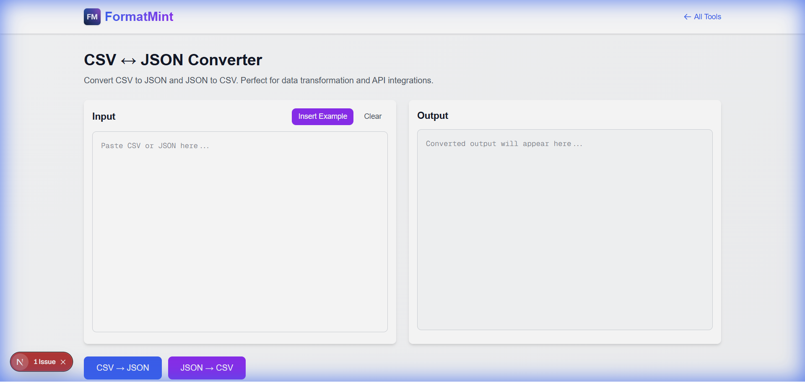

Data is messy. We all know it.

One day you're given a massive CSV export from a legacy system, and you need to use it in a modern JavaScript application. Or conversely, you have a nice clean JSON API response, but the business team needs it in Excel.

That's where the [CSV ↔ JSON Converter](/tools/csv-json-converter) comes in. It's a bridge between the spreadsheet world and the code world.



## The "Excel to API" Pipeline

I built this tool because I got tired of writing one-off Python scripts just to transform a client's spreadsheet into a JSON array I could actually use.

**Scenario:** A client sends you a list of 500 products in an Excel file (saved as CSV). They want them on the website *today*.
**Solution:**
1.  Open the CSV file in a text editor.
2.  Copy the raw text.
3.  Paste it into our converter.
4.  Boom. You have a valid JSON array ready to be pasted into your database seeder or config file. (Need to pretty-print it? Use the [JSON Formatter](/tools/json-formatter)).

## Handling the Edge Cases

Converting simple data is easy. But real-world data is rarely simple. Our tool handles the annoying stuff for you:

*   **Numbers vs Strings**: It intelligently guesses if "123" should be the number `123` or the string `"123"`.
*   **Nested Objects**: It can flatten nested JSON into dot-notation columns (e.g., `user.address.city`) for CSV export.
*   **Messy Spacing**: It trims whitespace so your database doesn't end up with `" New York "`.

## A Quick Example

Let's say you have this CSV:

```csv
id,name,active
1,Widget A,true
2,Widget B,false
```

Our tool transforms it into this clean JSON:

```json
[
  {
    "id": 1,
    "name": "Widget A",
    "active": true
  },
  {
    "id": 2,
    "name": "Widget B",
    "active": false
  }
]
```

Notice how it correctly identified `1` as a number and `true` as a boolean? That's the kind of detail that saves you from writing `parseInt()` checks later in your code.

## Why Not Just Use Excel?

Excel is great for viewing data, but terrible for structural conversion. It often mangles dates, strips leading zeros (RIP zip codes), and doesn't understand JSON nesting.

This tool runs entirely in your browser—your data never leaves your machine. So go ahead, paste that sensitive config file. It's safe.

[Convert your CSV/JSON now](/tools/csv-json-converter)
