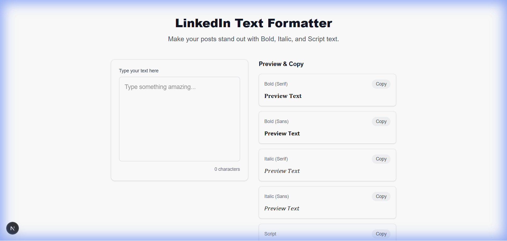
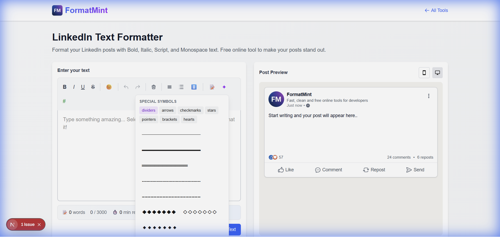
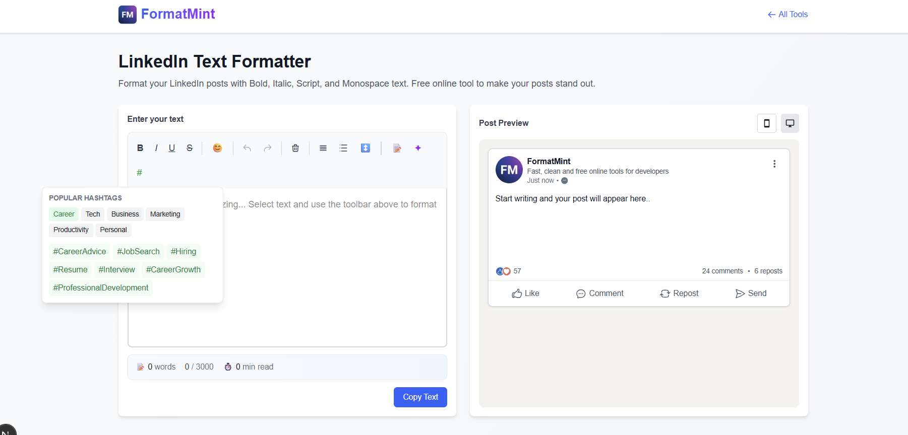

# How to Bold Text on LinkedIn (The Easy Way)

Ever typed out a LinkedIn post, hit publish, and felt... underwhelmed?

The text just sits there. No emphasis. No structure. Just a wall of words competing with every other plain-text post in the feed.

Here's the frustrating part: LinkedIn's editor doesn't let you format text. No bold button. No italics. Nothing.

But you've *seen* bold text on LinkedIn. You've seen script, underlines, even strikethrough. So what's the trick?

## The Unicode Secret

It's not a formatting feature—it's a **character swap**.

Unicode has multiple versions of the alphabet. A bold "A" isn't regular "A" with styling applied; it's a completely different character (`𝗔`). Same goes for italic (`𝘈`), script (`𝒜`), and others.

When you "format" text for LinkedIn, you're replacing each letter with its Unicode twin.

## Why This Matters for Your Posts

I've been posting on LinkedIn for a while now, and here's what I've noticed:

**The scroll is brutal.** Your post is competing with hundreds of others. A formatted headline stops the thumb. A bold takeaway gets read. A well-structured post actually gets finished.

**Humans scan first.** Nobody reads your 500-word thought piece word-by-word. They skim for bold phrases, bullet points, and anything that jumps out. If everything looks the same, nothing stands out.

## The Problem with Most LinkedIn Formatters

There are dozens of LinkedIn text formatters out there. I've tried them. Most do the basics—type in text, get bold text out.

But they're all missing the same things:

- **No idea if your hook works.** The first ~140 characters decide if someone taps "see more." Most tools don't show you this cutoff.
- **No templates.** You end up staring at a blank box every time.
- **No symbols or dividers.** Want a clean section break? Good luck finding the right Unicode character.
- **No hashtag help.** You know you should add hashtags. But which ones?

So I built something different.

## What Makes Our Formatter Different

### 1. The "See More" Preview

This is the killer feature. When your post hits ~140 characters on mobile, LinkedIn truncates it with "...see more."

That means your **first line is everything**. If it doesn't hook, nobody reads the rest.

Our tool shows you *exactly* where the cutoff happens and analyzes your hook. Questions, numbers, and bold statements work. Generic openers don't.

### 2. Post Templates

I got tired of starting from scratch. Now there are 6 proven formats built-in:

- **Hook + Story:** Open strong, tell a story, end with a lesson
- **Quick Tip:** One actionable takeaway with benefits
- **Listicle:** Numbered points that are easy to scan
- **Hot Take:** Unpopular opinion format (great for engagement)
- **Announcement:** Product launch, job change, milestone
- **Question Post:** Conversation starters

Click one. Fill in the blanks. Done.

### 3. Special Symbols & Dividers

Beyond emojis, you get access to:

- **Dividers:** `━━━━━━` `═══════` `◆◆◆◆◆`
- **Arrows:** `➤` `►` `⇒` `↗️`
- **Checkmarks:** `✓` `☑` `✅`
- **Decorative brackets:** `【 】` `『 』`

These make your posts visually distinct without being obnoxious.

### 4. One-Click Hashtags

Six categories of popular LinkedIn hashtags (Career, Tech, Business, Marketing, Productivity, Personal). Click to insert. No more googling "best LinkedIn hashtags 2026."

### 5. The Basics, But Better

Of course you still get:

- **Bold, Italic, Underline, Strikethrough** with inline selection
- **Bullet and numbered lists** with multiple symbol options
- **Emoji picker** with the most-used LinkedIn emojis
- **Undo/Redo** so you don't lose your work
- **Live preview** that looks like an actual LinkedIn post

## Quick Tips for LinkedIn Formatting

After formatting hundreds of posts, here's what actually works:

1. **One bold phrase per paragraph, max.** Any more and it loses impact.
2. **Use line breaks liberally.** Single sentences hit harder than dense paragraphs.
3. **Save the script font for your name or a signature.** It's hard to read at scale.
4. **Test on mobile.** That's where most people see your post.

## Try It

Here's the workflow:

1. Open the [LinkedIn Text Formatter](/tools/linkedin-text-formatter)
2. Pick a template or start writing
3. Use the toolbar to format as you go
4. Check the "See More" preview—is your hook good?
5. Copy → Paste into LinkedIn

No account. No install. Just works.

[**Open the LinkedIn Formatter →**](/tools/linkedin-text-formatter)
