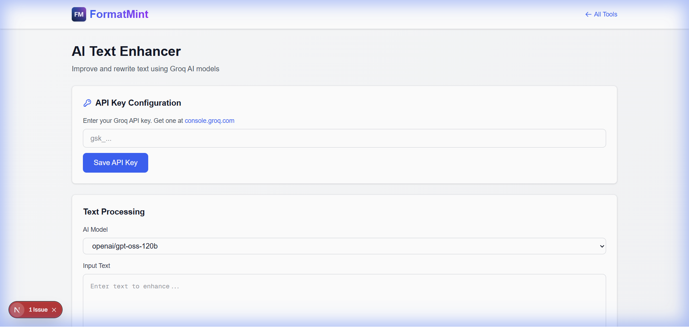

# How to Rewrite Text Professionally (Without Hiring an Editor)

We've all sent that email. The one where you hit "Send" and immediately realize you sounded too aggressive, too casual, or just... wrong.

Writing is hard. Writing *professionally* when you're tired, stressed, or in a rush is even harder.

That's why we built the **AI Text Enhancer**. It's not about letting a robot do your thinking; it's about having a second pair of eyes to polish your words before they go public.

## The "Second Draft" Problem

Most of us write our first draft and stop there. But professional writers know that the magic happens in the rewrite.

*   **The Problem:** You know *what* you want to say, but you can't find the right words.
*   **The Solution:** Write your messy thoughts down, then let the AI clean them up.

## Real World Example: The "Sick Day" Email

Let's say you wake up with a migraine. You need to email your boss, but your brain is foggy.

**Your Draft:**
> "hey boss i cant come to work 2day im sick thanks"

If you send that, you look unprofessional. But if you spend 20 minutes agonizing over "proper" wording, you're wasting time.

**The AI Fix:**
Paste that messy draft into our tool, select **Professional** mode, and you get:

> "Dear Manager, I am writing to inform you that I am unable to attend work today due to illness. I apologize for any inconvenience this may cause and appreciate your understanding."

Boom. Sent. Back to bed.

## How to Use It Effectively

### 1. Bring Your Own Key
We use Groq's super-fast AI models. To keep this tool free and private, you use your own API key.
*   It's free to get one.
*   It's stored **locally** in your browser.
*   We never see your key or your text.

### 2. Choose Your Mode
Context matters. You don't talk to your best friend the same way you talk to a client.
*   **Fix Grammar:** Just cleans up typos. Good for quick Slack messages.
*   **Professional:** The "Corporate Polish." Perfect for emails and reports.
*   **Casual:** Great for social media or internal team chats.
*   **Concise:** When you've written a novel but only need a paragraph.

### 3. Iterate
The best way to use AI is as a collaborative partner. If the first result is too formal, try the **Casual** mode. If it missed a detail, add it to your input and run it again.

## Pro Tip: The "Tone Check"
I use this tool to check my tone. If I'm writing a difficult feedback email, I'll draft it, then run it through the **Professional** filter. Often, the AI will soften my angry edges and make the feedback more constructive.

[**Enhance Your Writing Now →**](/tools/ai-text-enhancer)

## FAQ

**Is it cheating?**
No more than using spellcheck is cheating. You're providing the thoughts; the tool is just helping with the delivery.

**Is my text private?**
Yes. Your text goes directly from your browser to Groq's API. It never touches our servers, so we couldn't read your emails even if we wanted to.
