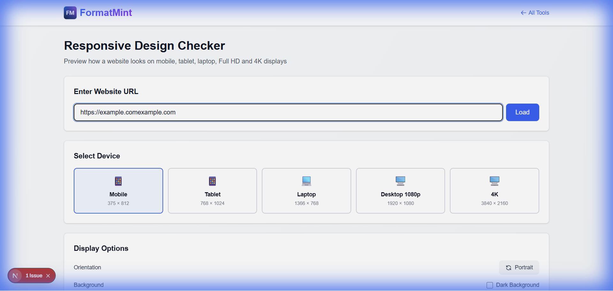

# How to Test Responsive Design Online (Without a Device Lab)

If you've ever deployed a website only to find out it looks terrible on your boss's iPhone, you know the pain of responsive design testing.

We all know we *should* test on multiple devices. But let's be real: nobody has a drawer full of every iPhone, Pixel, and iPad released in the last five years. And resizing your browser window only gets you so far—it doesn't account for touch targets, specific viewports, or orientation changes.

That's why we built the **FormatMint Responsive Design Checker**. It's a simple, free way to check your work on common screen sizes without leaving your browser.

## The "Good Enough" Trap

Most developers (myself included) fall into the trap of just resizing the Chrome window and calling it a day. "If it squishes okay, it's fine on mobile," right?

Wrong.

Real mobile devices have specific breakpoints and aspect ratios that free-resizing misses. A layout might break exactly at 375px (iPhone SE) but look fine at 400px. If you don't test the exact viewport, you won't catch the bug until a user complains.

## How to Check Your Site in 30 Seconds

You don't need to sign up or install anything. Here's the fastest workflow I use:

### 1. Load Your URL
Head over to the [Responsive Design Checker](/tools/responsive-checker). Paste your local host URL (yes, `localhost:3000` works if your server is running!) or your live site.

### 2. The "Big Three" Check
I usually check these three specific views to catch 90% of layout bugs:

1.  **Mobile (375x812):** This is your baseline. If it's broken here, it's broken for half your users. Look for horizontal scrolling (the enemy of mobile UX) and text that's too small to read.
2.  **Tablet (768x1024):** The awkward middle child. This is where hamburger menus often break or grid layouts get squished.
3.  **Laptop (1366x768):** Still the most common desktop resolution. Make sure your hero section doesn't take up the entire screen height.

### 3. Flip It
Don't forget to hit the **Rotate** button. Landscape mode on mobile is a notorious layout breaker because vertical space becomes scarce. If your sticky header takes up 50% of the screen in landscape, you need to fix it.

## Common Bugs You'll Find
*   **The "Overflow" Scroll:** When one element is slightly too wide (usually an image or a long URL), causing the whole page to wobble left and right.
*   **Unclickable Buttons:** Buttons that look fine with a mouse cursor but are impossible to tap with a thumb.
*   **Missing Padding:** Text running right up to the edge of the screen looks cheap. Give your content some breathing room.

## Give It a Try
Next time you're pushing code, take 30 seconds to run it through the checker. It's faster than firing up a simulator and way cheaper than buying a device lab.

[**Launch Responsive Checker →**](/tools/responsive-checker)

## FAQ

**Why does my site say "Refused to connect"?**
Big sites like Google or Facebook block tools like this for security (using `X-Frame-Options`). But for your own projects, it works perfectly.

**Can I test localhost?**
Absolutely. Since the tool runs in your browser, it can see whatever your computer can see. Just make sure your local server is running.
