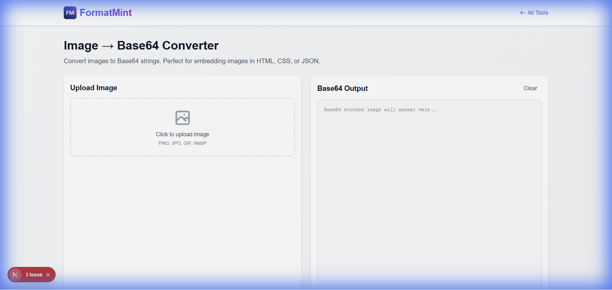

You're building a single-file HTML landing page. You want it to be blazing fast, with zero external requests. But you need a logo.

Do you host the image externally? No.
Do you ship a zip file? No.

You Base64 encode it.

Our [Image to Base64 Converter](/tools/image-base64) takes your binary image file and turns it into a text string that you can paste directly into your HTML or CSS.



## The Magic of `data:image`

A Base64 image isn't a file; it's a string. It looks like this:

```
data:image/png;base64,iVBORw0KGgoAAAANSUhEUgAAAAU...
```

When the browser sees this, it renders the image immediately. No network request needed. (Want to know how the encoding works? Read our [Base64 Guide](/blog/base64-encoding-guide)).

## When Should You Use This?

I see developers overuse this sometimes, so here's my rule of thumb:

### ✅ Use it for:
*   **Tiny Icons**: Social media icons, UI arrows, bullets.
*   **Critical LCP Images**: If your "Hero" image is small, embedding it can improve your Core Web Vitals by eliminating the network fetch.
*   **Email Templates**: Email clients are notorious for blocking external images. Embedded images often fare better.
*   **Offline-First Apps**: If you're building a dashboard that needs to work without internet, embedding assets is a solid strategy.

### ❌ Do NOT use it for:
*   **Large Photos**: Base64 increases file size by ~33%. A 1MB photo becomes 1.33MB of text. This bloats your HTML and hurts parsing performance. (Use our [Image Resizer](/blog/resize-images-online) to shrink them first!).
*   **Gallery Images**: If you have 50 images, lazy-loading external files is much better than a massive 50MB HTML file.

## How to Use It in Code

### In HTML (The `src` attribute)
```html

```

### In CSS (Background Images)
This is my favorite use case. Keeping UI assets inside your CSS file means one less HTTP request.
```css
.search-icon {
  background-image: url('data:image/svg+xml;base64,PHN2ZyB...');
  background-repeat: no-repeat;
}
```

## Pro Tip: SVG is Better
If you're encoding a vector icon, consider using SVG code directly instead of Base64. But for raster images (PNG, JPG), Base64 is the king of embedding.

[Embed your images now](/tools/image-base64)
