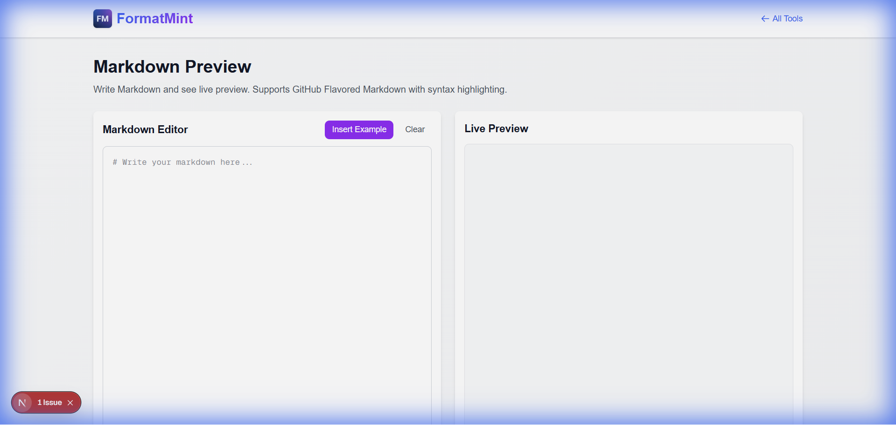

You know the feeling. You spend 20 minutes writing a beautiful `README.md` for your GitHub repo, commit it, push it, and... the table formatting is broken. Or the image link is dead.

Markdown is simple, but it's also unforgiving. That's why we built this [Markdown Preview Tool](/tools/markdown-preview). It's a split-screen editor that renders your Markdown in real-time, so you know exactly what it will look like *before* you commit.



## Why I Use This Tool Daily

I write a lot of documentation. And honestly, I don't want to fire up a heavy IDE just to draft a blog post or a quick guide.

This tool is perfect for:
*   **Drafting GitHub Issues**: I often draft complex issue descriptions here first to make sure my code blocks and checklists render correctly.
*   **Writing Blog Posts**: Like this one! I can see the structure, headers, and emphasis without getting distracted by a CMS interface. (If you need raw HTML, check out our [HTML Editor](/blog/html-editor-guide)).
*   **Learning Syntax**: If you're new to Markdown, it's the fastest way to learn. Type `**bold**` and see it become **bold** instantly.

## It's Not Just Basic Text

We support GitHub Flavored Markdown (GFM), which means you can do the cool stuff:

### 1. Syntax Highlighting
Writing code snippets? We've got you covered.

```javascript
// It handles code blocks beautifully
function sayHello() {
  console.log("Hello, World!");
}
```

### 2. Task Lists
Great for tracking progress in your PR descriptions.

- [x] Write the code
- [ ] Write the tests
- [ ] Fix the bugs

### 3. Tables That Actually Work
Tables in Markdown are notoriously annoying to type. The live preview helps you align those pipes `|` correctly.

| Feature | Support |
|---------|---------|
| Tables  | ✅ Yes  |
| Code    | ✅ Yes  |
| Images  | ✅ Yes  |

## A Quick Cheat Sheet

If you're just getting started, here are the essentials you'll use 90% of the time:

*   `# Header 1`, `## Header 2` for titles
*   `**Bold**` and `*Italic*` for emphasis
*   `[Link Title](URL)` for links
*   `` for images
*   `- List item` for bullet points
*   `1. List item` for numbered lists

## Stop "Commit-Squashing"

Don't be that person with 10 commits in a row labeled "fix readme formatting". Use the [Markdown Preview](/tools/markdown-preview) to get it right the first time. It's simple, fast, and runs entirely in your browser.
