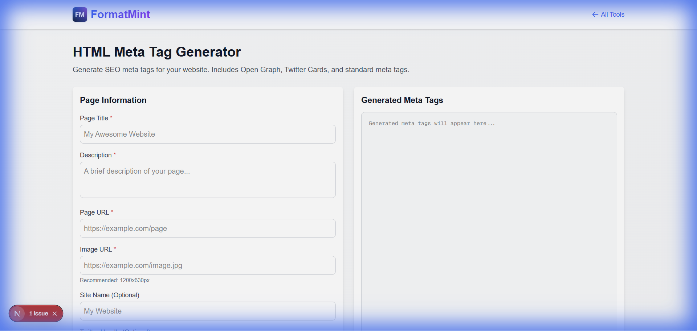

You spend weeks building a beautiful website. You deploy it. You share the link on Slack or Twitter.

And... no image. Just a boring blue link.

That's a tragedy.

Meta tags (specifically Open Graph tags) are the difference between a link nobody notices and a rich card that begs to be clicked. Our [Meta Tag Generator](/tools/meta-tag-generator) helps you build these tags correctly without memorizing the syntax.

## The "Big Three" of Meta Tags

If you only add three tags to your site, make it these:

### 1. The Title (`<title>`)
This is what shows up in the browser tab and the big blue link on Google.
*   **Rule:** Keep it under 60 characters. Put the important keywords first. (Check length with our [Word Counter](/blog/word-counter-text-tools)).

### 2. The Description (`<meta name="description">`)
This is the gray text under the link on Google.
*   **Rule:** Treat this like ad copy. Why should someone click? "Learn how to convert CSV to JSON" is better than "CSV Converter Page".

### 3. The Open Graph Image (`og:image`)
This is the thumbnail that appears on social media.
*   **Rule:** Use a 1200x630px image. If you don't define this, Facebook/LinkedIn will try to guess (and they usually guess wrong, picking a random icon or footer image). (Use our [Image Resizer](/blog/resize-images-online) to get the exact size).

## "Why doesn't my link preview update?"

This is the most common question I get.

You updated your `og:image`, deployed the site, but Slack/Twitter still shows the old image.

**The Answer:** Caching.
Social networks cache your meta tags aggressively (sometimes for weeks).

**The Fix:**
*   **Twitter/X**: Use their [Card Validator](https://cards-dev.twitter.com/validator) to force a refresh.
*   **Facebook/LinkedIn**: Use their "Sharing Debugger" tools to scrape the page again.
*   **Slack**: You often have to wait, or add a random query parameter to your link (`example.com?v=2`) to trick it into re-fetching.

## Don't Forget Mobile

One tag that isn't strictly "SEO" but is critical:
`<meta name="viewport" content="width=device-width, initial-scale=1">`

Without this, your mobile site will look like a tiny desktop site zoomed out. Always include it.

[Generate your tags now](/tools/meta-tag-generator)
