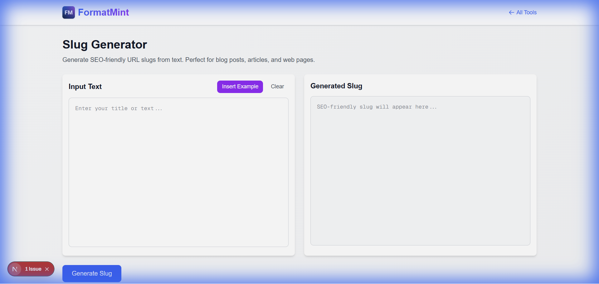

You've just written a great blog post titled "10 Tips for C++ Programming!". You hit publish.
The URL looks like this: `example.com/post?id=9823`.
Or worse: `example.com/10%20Tips%20for%20C++%20Programming!`.

Gross. And bad for SEO.

You need a slug. A slug is the URL-friendly version of a title.
`10-tips-for-cpp-programming`

Our [Slug Generator](/tools/slug-generator) handles this conversion instantly, stripping out special characters, lowercasing everything, and replacing spaces with hyphens.

## Why Slugs Matter (More Than You Think)

### 1. The "Google Factor"
Google reads URLs. If your URL is `/coffee-brewing-guide`, Google knows exactly what the page is about before it even crawls the content. If it's `/p=123`, you're missing a huge SEO opportunity. (Combine this with good [Meta Tags](/blog/meta-tags-seo-guide) for best results).

### 2. The "Trust Factor"
Which link would you click in a suspicious email?
*   `https://site.com/login.php?ref=x82`
*   `https://site.com/secure-login`

Clean, readable URLs build trust.

## How Our Tool Handles the Tricky Stuff

Creating a slug seems simple (just replace spaces with hyphens, right?), but there are edge cases that break simple scripts:

*   **Special Characters**: "C++" needs to become "cpp" or just "c", not "c--". Our tool strips unsafe chars intelligently.
*   **Accents**: "Café" should become "cafe", not "caf%C3%A9". We handle unicode normalization.
*   **Trailing Hyphens**: "Hello World " shouldn't become "hello-world-". We trim the edges.

## Best Practices for Slugs

I've built a lot of CMSs, and here are my golden rules for slugs:

1.  **Keep it Short**: Remove stop words like "a", "the", "and".
    *   *Bad*: `the-ultimate-guide-to-how-to-bake-a-cake`
    *   *Good*: `guide-baking-cake`
2.  **Lowercase Only**: Servers are sometimes case-sensitive. `.../Blog` and `.../blog` might be different pages. Always force lowercase to avoid 404s.
3.  **Hyphens over Underscores**: Google explicitly prefers hyphens (`-`) as word separators over underscores (`_`).

## For Developers

If you're building a blog or CMS, you often need to generate these slugs on the fly. Use this tool to test your own slug generation logic against ours. If your regex isn't handling "User's Guide & Tips" correctly (it should be `users-guide-tips`), come check how we do it.

[Generate your perfect slug](/tools/slug-generator)
