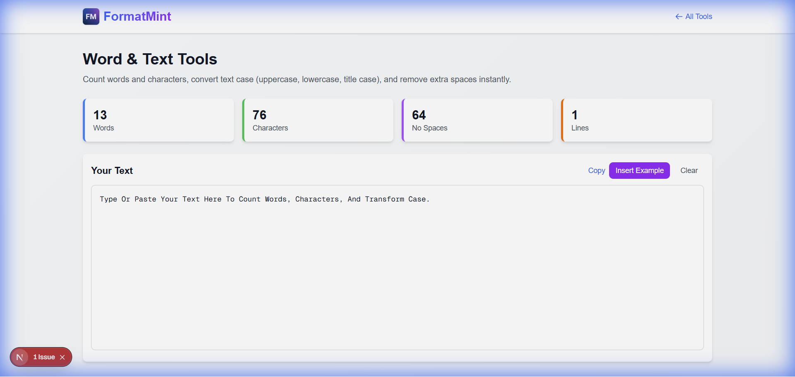

"Is this tweet too long?"
"Does my meta description fit?"
"Why is this JSON payload rejected?"

We deal with text limits every day. Whether you're a student trying to hit a 500-word minimum or a developer debugging a database truncation error, knowing your exact character count matters.

That's why we built this [Word & Text Tools](/tools/word-tools) suite. It's not just a counter; it's a Swiss Army knife for your text.

## More Than Just Counting

Sure, it counts words. But as developers and writers, we usually need more specific metrics.

### 1. The "Database Limit" Check
I often use this when designing database schemas. If I have a `VARCHAR(160)` column, I need to know if my sample content fits.
*   **Character Count (with spaces)**: The real storage size.
*   **Character Count (no spaces)**: Useful for billing or specific algorithms.

### 2. The "Social Media" Check
*   **Twitter/X**: 280 characters.
*   **LinkedIn**: 3000 characters for posts.
*   **SEO Titles**: ~60 characters before truncation. (See our [Slug Generator Guide](/blog/seo-friendly-url-slugs) for URL tips).

Our tool updates these stats in real-time as you type, so you can edit down to the perfect length without guessing. (Writing meta descriptions? Check our [Meta Tag Guide](/blog/meta-tags-seo-guide)).

## Text Transformation: The Hidden Gem

Beyond counting, this tool helps you *fix* text.

**Scenario:** You copy a list of names from a PDF, and they're all in `UPPERCASE` with weird spacing.
**Fix:**
1.  Paste into the tool.
2.  Click **Title Case** (converts to "John Doe").
3.  Click **Remove Extra Spaces** (fixes the PDF formatting artifacts).
4.  Copy perfectly formatted text.

## Why "Sentence Case" Matters

If you're converting a lot of legacy data or user-submitted content, the **Sentence case** button is a lifesaver. It capitalizes the first letter of each sentence while keeping the rest lowercase. It's perfect for cleaning up shouty comments or messy inputs.

## Privacy First

Unlike some other tools that send your text to a server to be processed, this tool runs **100% in your browser**.
*   Paste your draft emails.
*   Paste your sensitive docs.
*   Paste your code comments.

Nothing leaves your device.

[Start counting and formatting now](/tools/word-tools)
